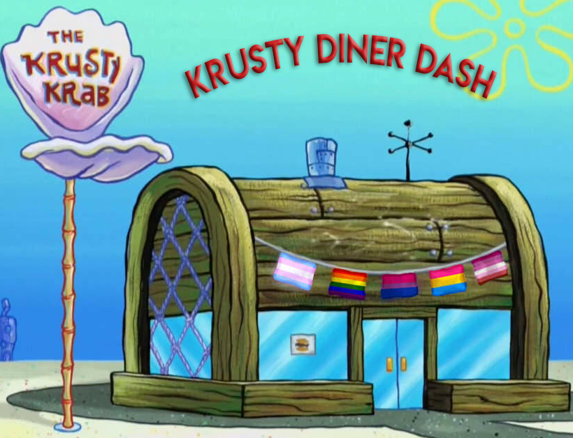
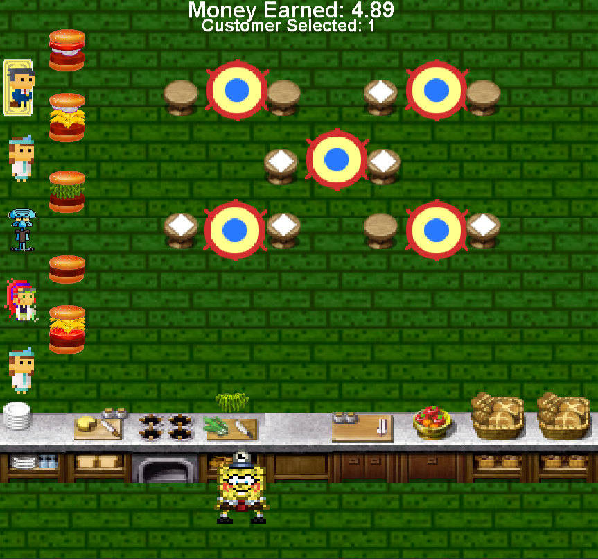
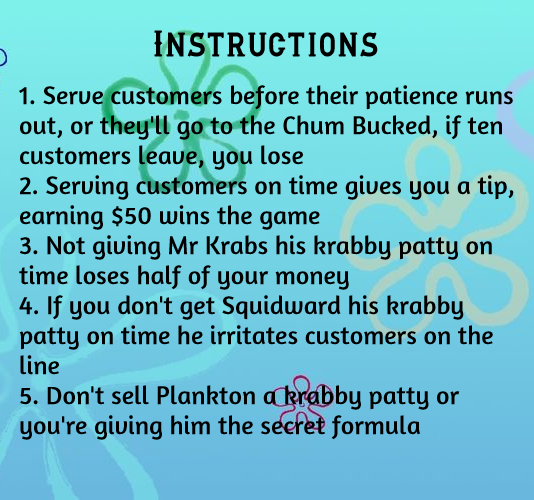
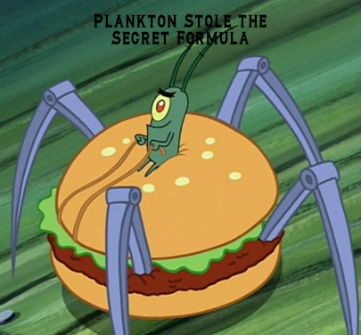

## Advanced Programming Project 2 - Krusty Diner Dash

Diner Dash style game where your play as SpongeBob and serve krabby patties to the customers at the Krusty Krab.

SpongeBob automatically moves from side to side, you press R to add an ingredient to the krabby patty
while you're in front of that counter.

Your main objective is to serve customers their orders as fast as possible.
You get a tip for serving quickly, if ten customers leave, you loose.
Customers start tu turn red when they become impatient.

If you serve plankton a krabby patty he steals the secret formula causing you to loose the game.

### **Controls:**
* Add Ingredient = R
* Slow Down = SHIFT
* Serve Customer = 1, 2, 3, 4 & 5
* Pause = ESC

 

###### Disclaimer: I do not own any of the images and sounds used in this project. They were only used for educational purposes.
